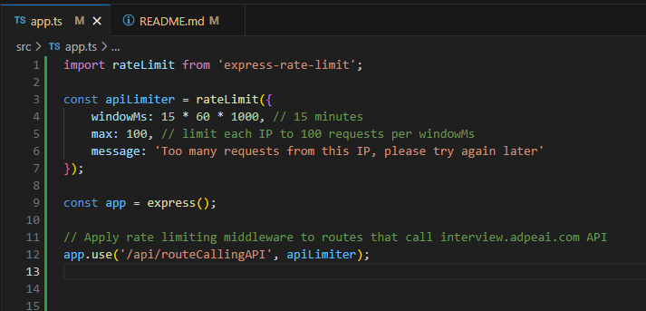

# Calculator Application

  

## Overview
Application that performs basic mathematical operations.
1. Getting calculations requests from the server
2. Executing calculations at runtime
3. Sending the result to the server for verification
4. Handling server response

## Installation
### 1. Clone this repo from github
    git clone https://github.com/gustavogmail/calculation.git
### 2. Install the dependencies:
    npm install

## How to run
    npm start
#### To see the dashboard, open a browser on:
  http://localhost:3001/
#### Dashboard view:
  

## Development
### Execute ESLint check:
    npm run lint
### Run the unit tests:
    npm test
#### Unit Tests result:
  

### 1. Run the server locally:
    npm run run:server:local
### 2. In a separated terminal tab, run the client locally:
    npm run run:client:local
### 3. Open the dashboard on:
  http://localhost:3000

## Technical details
### Dependencies used on server side:
- <b>Express:</b> application web server
- <b>CORS:</b> security package necessary to allow communication with frontend
- <b>DotEnv:</b> configuration package to handle environment variables
- <b>Helmet:</b> helps secure Express apps by setting HTTP response headers
- <b>Morgan:</b> package for logging requests on the terminal
- <b>Express Async Errors:</b> package to be able to catch asynchronous errors

### Dependencies used on client side:
- <b>React:</b> framework to build user interfaces components
- <b>Bootsrapp:</b> css library

## Bonus Question
### How to handle 429 (Too Many requests) in the submission endpoint ?

There are a few ways to handle this scenario. We can choose the one that best fits to our context.

#### 1. Using a messaging queue system as AWS SQS
- We can indeed handle this error using a messaging system like Amazon SQS (Simple Queue Service) along with a Dead Letter Queue (DLQ).
- The DLQ will capture messages that couldn't be processed successfully after a certain number of retries.
- <b>Retry Logic with Backoff:</b> We can implement retry logic within our application to handle failures. When a request fails due to a 429 error, instead of immediately retrying, the message can be sent back to the SQS queue with a delay using an exponential backoff strategy to prevent overwhelming the API.

#### 2. Implement Rate Limiting:
We can use a middleware to limit the number of requests our application can make to the interview.adpeai.com API within a certain time frame. We can use existing libraries like express-rate-limit to implement rate limiting in our Express application.

Implementation example:

  

