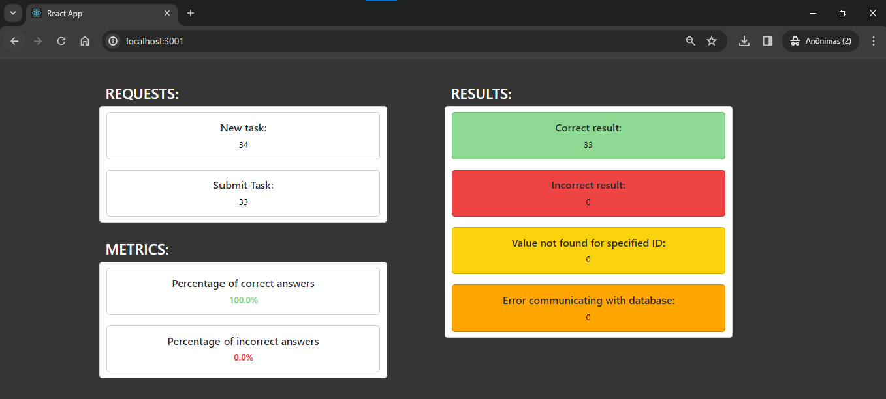
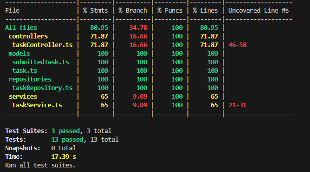

# Calculator Application

  

## Overview
Application that performs basic mathematical operations.

## Installation
### 1. Clone this repo from github
    git clone https://github.com/gustavogmail/calculation.git
### 2. Install the dependencies:
    npm install

## How to run
    npm start
#### To see the dashboard, open a browser on:
  http://localhost:3001/
#### Dashboard view:
  

## Development
### Execute ESLint check:
    npm run lint
### Run the unit tests:
    npm run test
#### Unit Tests result:
  

